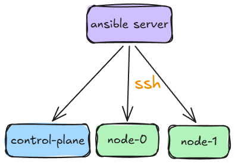

# Kubernetes Cluster Deployment using Ansible and Kubeadm

This repository contains Ansible playbooks and configurations to automate the deployment and setup of a Kubernetes cluster using `kubeadm` on Ubuntu/Debian machines.

It automates the installation and configuration of:
- **containerd** – Container runtime
- **kubeadm, kubelet & kubectl** – Kubernetes cluster bootstrapping and administration tools
- **Calico** – Pod networking and network security policies (CNI)
- **MetalLB** – LoadBalancer implementation for bare-metal Kubernetes clusters

## Prerequisites

This setup requires:

- **1 Jumpbox / Ansible Server** (Optional: You can run Ansible commands directly from your local machine instead)
- **1 Control Plane** (Master Node)
- **2 Worker Nodes** (Adjustable as needed)

### On All Machines

Set the root password:
```bash
sudo passwd root
```

Enter root mode:
```bash
su - root
```

Edit the `/etc/ssh/sshd_config` SSH daemon configuration file and set the `PermitRootLogin` option to `yes`:

```bash
sed -i \
  's/^#*PermitRootLogin.*/PermitRootLogin yes/' \
  /etc/ssh/sshd_config
```

Restart the `sshd` SSH server to apply the updated configuration:

```bash
systemctl restart sshd
```


## On the Ansible Server

Enter root mode:
```bash
su - root
```

You must edit `inventory/hosts` and `machines.txt`.

Example contents of `machines.txt`:
```text
192.168.1.202 control-plane 
192.168.1.203 node-0 
192.168.1.204 node-1
```

Append the machine list to the `/etc/hosts` file:
```bash
sudo sh -c 'cat machines.txt >> /etc/hosts'
```

Generate an SSH key:
```bash
ssh-keygen
```

Copy the SSH public key to each machine:
```bash
while read IP FQDN HOST SUBNET; do
  ssh-copy-id root@${IP}
done < machines.txt
```

Once each key is added, verify that SSH public key access is working:
```bash
while read IP FQDN HOST SUBNET; do
  ssh -n root@${IP} hostname
done < machines.txt
```

Expected output:
```text
server
node-0
node-1
```

Optionally, add the hosts to your known hosts:
```bash
ssh-keyscan -H 192.168.1.202 >> ~/.ssh/known_hosts
ssh-keyscan -H 192.168.1.203 >> ~/.ssh/known_hosts
ssh-keyscan -H 192.168.1.204 >> ~/.ssh/known_hosts
```

Install Ansible:
```bash
apt install software-properties-common
add-apt-repository --yes --update ppa:ansible/ansible
apt update
apt install -y ansible
```

Optionally, configure Ansible to display task running times:
```bash
mkdir -p /etc/ansible
vi /etc/ansible/ansible.cfg
```

Add the following line to the file:
```ini
callback_whitelist = profile_tasks
```

Test connection to the hosts:
```bash
ansible kubernetes -m ping -i inventory.ini
ansible workers -m ping -i inventory.ini
ansible control_plane -m ping -i inventory.ini
ansible all -m ping -i inventory.ini
```

Apply the Ansible playbooks:
```bash
ansible-playbook playbooks/site.yml

# Using a custom inventory file:
ansible-playbook -i inventory/hosts playbooks/site.yml
```